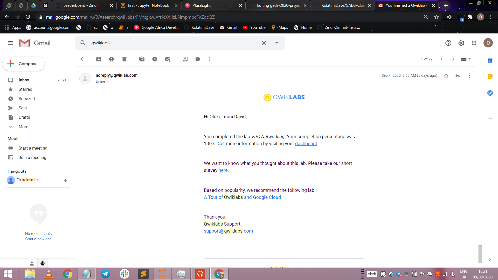
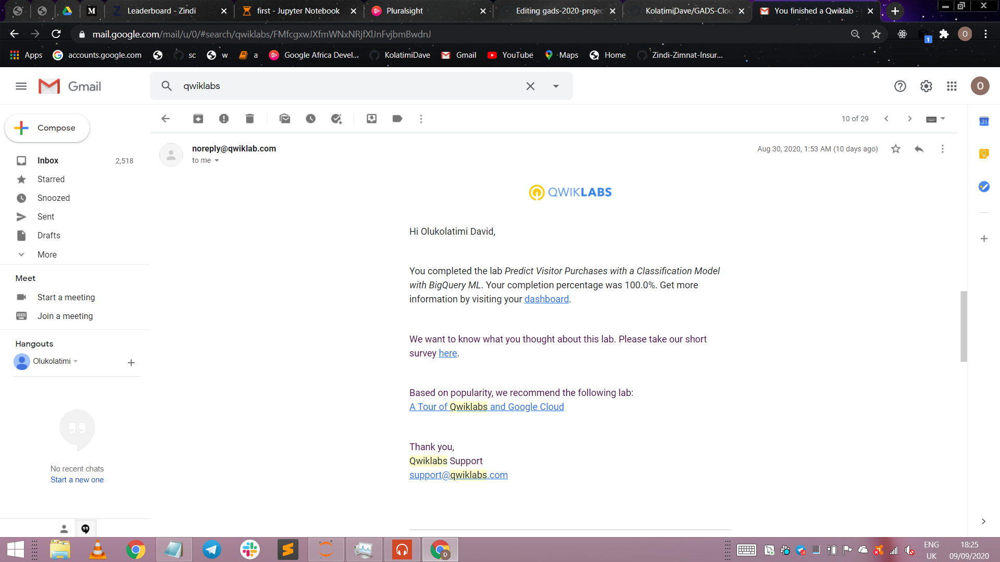

# KolatimiDave-GADS-Cloud
GADS-2020-practice- project-submission

## QwikLabs Completed

<details>
  <!-- The complete lab title goes here 👇🏾-->
  <summary>Lab 1: Creating Virtual Machines</summary>
  <!-- Provide path to the screenshot here. Example 👇🏾-->
  
</details>

<details>
  <!-- The complete lab title goes here 👇🏾-->
  <summary>Lab 2: Working with Virtual Machines</summary>
  <!-- Provide path to the screenshot here. Example 👇🏾-->
  
</details>

<details>
  <!-- The complete lab title goes here 👇🏾-->
  <summary>Lab 3: Explore a BigQuery Public Dataset</summary>
  <!-- Provide path to the screenshot here. Example 👇🏾-->
  
</details>

<details>
  <!-- The complete lab title goes here 👇🏾-->
  <summary>Lab 4  : Console and Cloud Shell</summary>
  <!-- Provide path to the screenshot here. Example 👇🏾-->
  
</details>

<details>
  <!-- The complete lab title goes here 👇🏾-->
  <summary>Lab 5: Infrastructure Preview</summary>
  <!-- Provide path to the screenshot here. Example 👇🏾-->
  
</details>

<details>
  <!-- The complete lab title goes here 👇🏾-->
  <summary>Lab 6: Recommending Products using Cloud SQL and Spark</summary>
  <!-- Provide path to the screenshot here. Example 👇🏾-->
  
</details>

<details>
  <!-- The complete lab title goes here 👇🏾-->
  <summary>Lab 7: Getting Started with BigQuery</summary>
  <!-- Provide path to the screenshot here. Example 👇🏾-->
  
</details>

<details>
  <!-- The complete lab title goes here 👇🏾-->
  <summary>Lab 8 : Getting Started with Deployment Manager and Cloud Monitoring</summary>
  <!-- Provide path to the screenshot here. Example 👇🏾-->
  
</details>

<details>
  <!-- The complete lab title goes here 👇🏾-->
  <summary>Lab 9: Getting Started with App Engine</summary>
  <!-- Provide path to the screenshot here. Example 👇🏾-->
  
</details>

<details>
  <!-- The complete lab title goes here 👇🏾-->
  <summary>Lab 10: Getting Started with Compute Engine</summary>
  <!-- Provide path to the screenshot here. Example 👇🏾-->
  
</details>

<details>
  <!-- The complete lab title goes here 👇🏾-->
  <summary>Lab 11: VPC Networking</summary>
  <!-- Provide path to the screenshot here. Example 👇🏾-->
  
</details>

<details>
  <!-- The complete lab title goes here 👇🏾-->
  <summary>Lab 12: Create a Streaming Data Pipeline for a Real-Time Dashboard with Cloud Dataflow</summary>
  <!-- Provide path to the screenshot here. Example 👇🏾-->
  
</details>

<details>
  <!-- The complete lab title goes here 👇🏾-->
  <summary>Lab 13: Getting Started with Cloud Marketplace</summary>
  <!-- Provide path to the screenshot here. Example 👇🏾-->
  
</details>

<details>
  <!-- The complete lab title goes here 👇🏾-->
  <summary>Lab 14: Predict Visitor Purchases Using BigQuery ML</summary>
  <!-- Provide path to the screenshot here. Example 👇🏾-->
  
</details>

<details>
  <!-- The complete lab title goes here 👇🏾-->
  <summary>Lab 15: Implement Private Google Access and Cloud NAT</summary>
  <!-- Provide path to the screenshot here. Example 👇🏾-->
  
</details>


## Translation code

```
Your translations code can rest here
```
